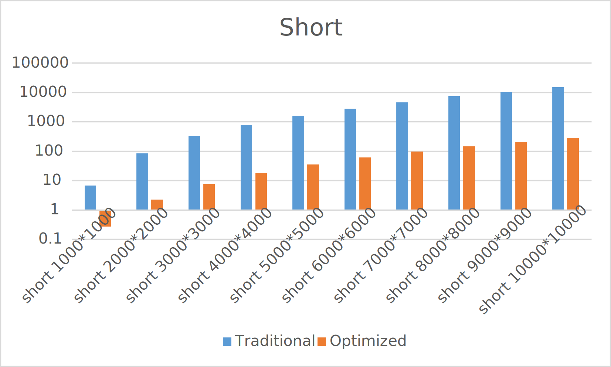
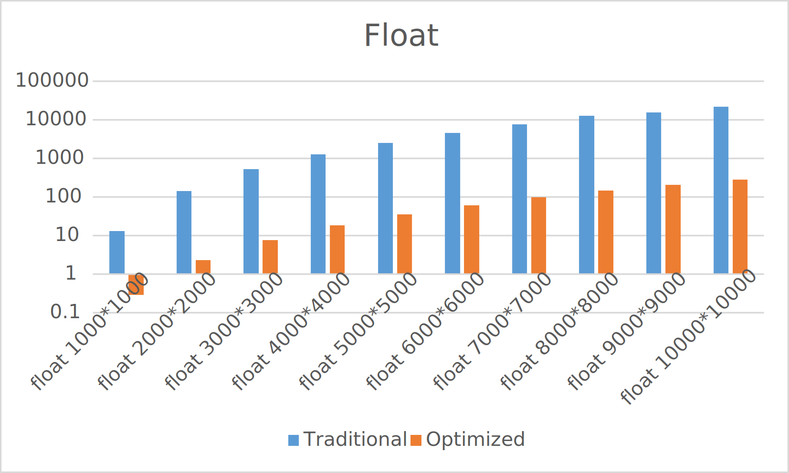

# Introduction
Single instruction, multiple data (SIMD) is a kind of computing method that enables the processing of multiple data within the same operation. By using this method, the programmers can utilize the special hardware design to accelerate the processing. Matrix-matrix multiplication, one of the most important data processing kernels, is one kind of operation which can be accelerated by using SIMD. In this mini-project, the team implements the SIMD programming and cache access optimization in the code to greatly reduce the processing time of large scale matrix-matrix multiplication (from 1000×1000 matrix to 10000×10000 matrix) and compares the results with the convention methods without any intentional optimization. The solution supports the configurable matrix size, even with size larger than the on-chip cache capacity and both fixed-point and floating-point data. 

# Overall Design
To accept both 2-byte fixed-point number and 4-byte floating number as the matrix entries, the `Matrix` class is designed as a template. For both traditional and optimized approach, the same `Matrix` class is used except the member functions of matrix multiplication.

# `Matrix` Class Structure
### `T **MATRIX`
This pointer of pointers contains the memory address of all the numbers in the matrix.
### `size_t ROW`
This is the number of rows the matrix has.
### `size_t COL`
This is the number of columns the matrix has.
### `Matrix()`
This is the default constructor of the `Matrix` class. When no value is provided, the `**MATRIX` will point to `nullptr` and `ROW` and `COL` will be initialized to 0. 

### `Matrix(size_t row, size_t col)`
This is the constructor when there is no initial value provided. First the function will check whether the matrix is meaningful (contains positive numbers of rows and columns). Then it will assign certain number of memory blocks based on the type of the numbers (2 bytes or 4 bytes). The number in the memory address will not be initialized.

### `Matrix(size_t row, size_t col, const T init_val)`
This is the constructor where there is initial value. Unlike `Matrix(size_t row, size_t col)`, the memory blocks assigned to the matrix will be assigned the initial value.

### `T &operator()(size_t i, size_t j)`
This is the operator to access the certain entry in the matrix. This can be useful to check the values in the result.

### `T operator()(size_t i, size_t j) const`
This provides the same function as `T &operator()(size_t i, size_t j)`.

# Matrix Multiplication
## Traditional Matrix Multiplication
`Matrix multiply(const Matrix &B)` is in `Traditional_Short.cpp` and `Traditional_Float.cpp`. To compute the product of matrix, the program can either start from rows first or start from columns. In this member function, the program will compute the product from columns first. The outer loop will loop from the columns and the inner loop will loop from the rows. To ensure that the the number of columns in the first matrix is equal to the number of rows in the second matrix, `COL == B.ROW` is checked before doing any further calculation of matrix products. This calculation is not optimized for SIMD or cache access optimization, therefore can take from several seconds to several hours to get the results depending on the size of the two matrices. 

## Optimized Matrix Multiplication
To further reduce the time required for matrix multiplication. SIMD and cache access optimization are used in both `Optimized_Short.cpp` and `Optimized_Float.cpp`. The matrix multiplication approach in these two files are the same. To use AVX2 and improve the portability of the code, the `Matrix` class in both cases are designed to be of type `double`. In the testing, compared to the code using AVX, the code using AVX2 still runs faster despite the performance penalty of using `double` as the type of the class.
### Cache Access Optimization
`Matrix multiply(const Matrix &B)` is in both `Optimized_Short.cpp` and `Optimized_Float.cpp`. First the function will ensure the the number of columns in the first matrix is equal to the number of rows in the second matrix. Then it will initialize a new matrix called `result` to save the product of matrices. Because of the size of the matrix, it is impossible for the CPU to put it in the L1, L2 or L3 cache. Instead, the matrix will be in the RAM. Also, each pair of neighboring rows is not saved in continuous memory address. When accessing two rows at the same time, the cache access time will be increases. To solve the problem, `*temp[2]` will be used to get two rows of data into the cache to improve the operating time. After the data is in the cache, the function will call SIMD matrix multiplication to get part of the product. Then it will move to the next 2 rows to until all elements in the `result` are calculated. `result` will be returned.
### SIMD Matrix Multiplication
`void multiply_kernel(double **result, double **a, double **b, int row, int col)` is in both `Optimized_Short.cpp` and `Optimized_Float.cpp`. This function will be called by `Matrix multiply(const Matrix &B)` after the cache access optimization is completed. By using AVX2, 4 `double` number will be processed at the same time. This function will take the whole second matrix and two rows of the first matrix. Then it will compute the products for these two rows using SIMD to save time and save the products into `result`.

# Usage
The code may be compiled on Windows operating system using Mingw's g++ program. However, during the execution phase, the code will not run correctly. Therefore, Linux is required to run both the traditional and optimized code. 
- To compile the traditional code, run
`g++ [Traditional_XXX.cpp] -o [Output_File_Name.out]` and `./Output_File_Name.out` after the compile is completed in the terminal. The execution of the traditional code does not require specific SIMD instruction set.
- To compile the optimized, run `g++ -mavx2 [Optimized_XXX.cpp] -o [Output_File_Name.out]` and `./Output_File_Name.out` after the compile is completed in the terminal. AVX2 is required to run the code.

The code will then automatically run the multiplication on different sizes of matrices, from 1000×1000 to 10000×10000. For the optimized code, depending on the system performance, the multiplication of 10000×10000 matrix should take less than 500 seconds. For the traditional code, the multiplication of 10000×10000 matrix can take several hours.

# Testing Configuration
- CPU: Intel Core i7-10700KF
- GPU: Nvidia Geforce 1660 Super
- RAM: 64GB DDR4 Memory
- OS:  Ubuntu 18.04 LTS in VirtualBox on Windows 10 Pro 64-bit

# Results
For the 2-byte fixed-point matrix multiplication, the results are shown below:
| Matrix Size | Traditional (sec) | Optimized (sec)
| ----------- | ----------- | ----------|
| 1000×1000 | 6.882 | 0.271 |
| 2000×2000 | 85.85 | 2.248 |
| 3000×3000 | 333.018 | 7.692 |
| 4000×4000 | 789.918 | 18.297 |
| 5000×5000 | 1627.98 | 35.773 |
| 6000×6000 | 2856.81 | 61.57 |
| 7000×7000 | 4621.21 | 99.035 |
| 8000×8000 | 7539.79 | 147.494 |
| 9000×9000 | 10565.2 | 207.581 |
| 10000×10000 | 15214.2 | 284.932 |

For the 4-byte floating-point matrix multiplication, the results are shown below:
| Matrix Size | Traditional (sec) | Optimized (sec)
| ----------- | ----------- | ----------|
| 1000×1000 | 12.996 | 0.288 |
| 2000×2000 | 143.416 | 2.309 |
| 3000×3000 | 525.691 | 7.606 |
| 4000×4000 | 1291 | 18.337 |
| 5000×5000 | 2501.49 | 35.377 |
| 6000×6000 | 4548.29 | 61.181 |
| 7000×7000 | 7672.94 | 98.059 |
| 8000×8000 | 12690.1 | 145.061 |
| 9000×9000 | 15473.2 | 208.056 |
| 10000×10000 | 21847.8 | 284.272 |

From the results, we can find that when the matrix size is large (10000×10000), the optimized code executed about 50 times faster in the 2-byte fixed-point matrix and about 75 times faster in the 4-byte floating-point matrix. When the matrix size is relative small (1000×1000), the optimized code executed about 25 times faster in the 2-byte fixed-point matrix and about 45 times faster in the 4-byte floating-point matrix. Overall, the SIMD programming and cache access optimization accelerated substantially in the matrix multiplication compared to traditional approach.
